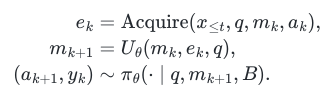
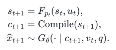

# Modeling Notes

These two interfaces make the survey's distinctions explicit. They are organizing abstractions, not equations claimed by every cited method.

## Evidence, Memory, and Actions



[LaTeX source](../assets/math/reasoning-loop.tex)

`x_t` denotes observations, `q` the request, `m_k` retained memory, and `B` the compute budget. At reasoning step `k`, an acquisition action `a_k` selects evidence `e_k`; the update function `U` incorporates it; a policy chooses the next action and candidate output `y_k`.

This separates three costs that answer accuracy alone hides: observing video, retaining information, and performing additional inference. Offline methods may access the full recording; streaming methods may access only the observed prefix. A generated frame is a hypothesis, not a new observation of the real environment.

Use the interface to compare methods at matched frame/token, memory, and tool-call budgets. For proactive systems, an output may be a response or a decision to wait. The policy's conditioning on `B` does not itself enforce a hard budget; the runtime must do that.

## Executable State and Learned Rendering



[LaTeX source](../assets/math/world-interface.tex)

`p_t` is a program, `s_t` its world state, and `u_t` a world action. Execution `F` advances state; compilation converts the result into visual constraints `c_t`; the generator `G` renders them using visual context `v_t` and semantic intent `q`.

This interface is inspired by [Code World Model](https://arxiv.org/html/2608.25927v1#S3). Its deterministic transition is one design choice: uncertain inferred state and stochastic dynamics need additional modeling. A coding agent implementing plausible rules has not necessarily identified the true physical dynamics of an observed scene.

| Claim | Evidence to request |
| :--- | :--- |
| Persistent state | Revisit an object after occlusion and test intervening changes |
| Executable dynamics | Run unseen actions and inspect state transitions |
| Physical identification | Compare inferred parameters and counterfactual outcomes with ground truth |
| Faithful rendering | Check agreement between executed state and generated frames |
| Useful planning | Test action success under matched rollout and search budgets |

See [Worlds as Programs](world-models.md) for paper-specific interfaces and limitations, and the [evaluation playbook](../README.md#evaluation-and-open-problems) for comparison controls.

## Editing Formulas

Edit `assets/math/*.tex`, then regenerate and check the SVGs:

```sh
npm ci --prefix tools/math
npm run render --prefix tools/math
npm run check --prefix tools/math
```

The renderer embeds glyph paths and a white backing for legibility on light and dark pages. No external fonts or equation service are needed. Inspect the resulting images after changing notation.
