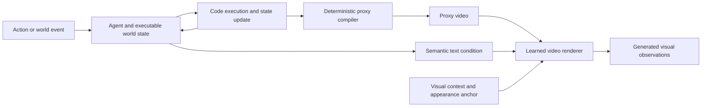

# Worlds as Programs

A companion to the [Reasoning Stack](../README.md#taxonomy-and-modeling) and [executable/hybrid catalog](../README.md#executable-world-models): how explicit state, code, and video generation can support prediction and action.

## The Core Idea

A persistent world needs **state** that survives interactions, **dynamics** that advance it, and **observations** that reveal the result. Four distinctions matter:

| Concept | Meaning | Limit |
| :--- | :--- | :--- |
| State | What holds: entities, attributes, relations, history | A scene description need not model transitions |
| Dynamics | How actions and events change state | Correct code can still encode the wrong rule |
| Inferred state | A hypothesis constrained by observations | Hidden state may remain ambiguous |
| Visual realization | A depiction conditioned on state | Rendered events may contradict executed state |

Programs are one reasoning engine alongside text, frames, graphs, and neural latents. Interleaving and streaming govern how these engines interact.

## Research Lineage

These are conceptual connections, not claims of direct technical ancestry.

| Work | Contribution | Scope |
| :--- | :--- | :--- |
| [WorldCoder](https://arxiv.org/abs/2402.12275) | Python world models revised through interaction and used for planning | Gridworld/task-planning foundation |
| [GIF-MCTS](https://arxiv.org/abs/2405.15383) | Search-guided generation and repair of transition programs | Textual descriptions and curated traces |
| [Spatial Code](https://arxiv.org/abs/2603.05591) | Explicit spatial variables from video for reasoning | Video QA; no complete dynamics program implied |
| [SWoMo](https://arxiv.org/abs/2605.16530) | Rule-based surgical simulator paired with a learned video renderer | Tool–tissue interactions; domain-specific rules |
| [VisualPatchWorld](https://arxiv.org/abs/2607.25236) | Probe dynamics, fit program parameters, and plan | Visual state can enter at replanning time |
| [VideoCoCo](https://arxiv.org/abs/2607.27380) | Executable Blender drafts followed by generative video editing | Text-to-video process control; not video-to-rule identification |
| [PhysMind](https://arxiv.org/abs/2608.04575) | Recover a video scene and fit reusable analytic dynamics | Physical and counterfactual QA; not a time-stepped simulator |
| [Code World Model](https://arxiv.org/abs/2608.25927) | Executable state → proxy video → learned rendering | Direct video-world interface |
| [Code as Worlds](https://arxiv.org/abs/2608.27549) | Propose, execute, render, and verify physical world hypotheses | Executable representations provide physical-reasoning supervision |
| [StateAgent](https://arxiv.org/abs/2609.03673) | Update entity state and condition video continuation | State consistency across segments |
| [Programmable World Model](https://arxiv.org/abs/2609.10540) | Persistent programs, off-screen state, and state-augmented 3D boxes | Engine-maintained state compiled into video conditioning |
| [Recursive Code World Models](https://arxiv.org/abs/2609.11499) | Recursive executable scene construction from an image | Reconstruction, not demonstrated temporal dynamics |

*WorldCoder* is a planning method; *WorldCoder-Bench* evaluates generated 3D programs. Models that predict software execution traces form another line: sharing the “code world model” name does not make their interfaces equivalent.

The [expanded executable-world index](review-2026/executable.md) covers direct video systems, visual bridges, and planning foundations. The neighboring [world-model chapter](review-2026/worlds.md) covers neural prediction and control. The key comparison is **where state comes from, which rules are supplied or inferred, what executes them, and how outputs are checked**.

## Inside Code World Model

Based on [v1, Sections 3–5](https://arxiv.org/html/2608.25927v1) and the [author repository](https://github.com/buaacyw/code-world-model).

The **coding agent** handles complex decisions and program revision. **Code** executes frequent updates. A deterministic **proxy compiler** turns selected state into spatial constraints; the **video model** realizes appearance and motion.

The proxy encodes coarse geometry, camera motion, poses, and relations; text supplies semantic intent and appearance. More proxy detail can improve control while restricting visual freedom. Agent reasoning, code execution, and video generation operate on separate clocks; the diagram does not imply a demonstrated real-time loop.

### Evidence & Limits

- **Training:** LoRA adaptation of MiniMax-H3 Ref2VA on 157 gameplay takes—about 5.6 hours—sampled into 9,420 overlapping five-second clips. These are not independent source sequences; audio loss is disabled.
- **Inference:** existing engine code and templates support world construction. Recorded proxy sequences and a first-frame appearance anchor condition video generation; longer outputs stitch overlapping windows.
- **Results:** qualitative control of layout, camera motion, and entity motion. Comparisons exclude latency.
- **Open capabilities:** the paper does not demonstrate autoregressive real-time generation or autonomous construction of a complete open-world simulator.
- **Release:** a LoRA adapter and compact inference examples, not a standalone base model or the complete training set. This survey has not run or reproduced the system.

The contribution is the **persistent executable transition mechanism** coupled to learned rendering. Evaluate its rules, environmental validity, and visual compliance separately; success in one does not certify the others.

## A Testbed for World Reasoning

[WorldCoder-Bench](https://arxiv.org/abs/2606.01869) motivates checking runtime behavior beyond visible appearance. It is an executable-world benchmark, not video QA. The following is a proposed evaluation design.

| Layer | Controlled test | Measure |
| :--- | :--- | :--- |
| Perception | Match video prefixes, views, and action access; label oracle-state ablations | State accuracy, occlusion errors, uncertainty |
| Dynamics | Hold initial state fixed; vary actions, parameters, and rules | Multi-step error, invariants, rare-event failures |
| Rendering | Change appearance at fixed state, then state at fixed appearance | State compliance, identity, trajectory control, visual quality |
| Planning | Match planner, tools, feedback, and search budget | Task success and predicted-versus-real outcome gap |
| Continual interaction | Introduce off-screen events, interruptions, sensor errors, and rule changes | Persistence, repair regressions, recovery, latency |
| Cost | Freeze versions, seeds, programs, and inputs | Tokens, execution/rendering time, memory |

**Example: an off-screen door.** Start from the same state; unlock it in one trial and leave it untouched in another. Move away, introduce intervening events, then return. Check the stored lock state, allowed action, and rendered response. Separately vary appearance and mechanics to isolate memory, dynamics, and rendering.

Future work should test **video-to-rule induction**, **active probes**, **state/render conflict resolution**, and **program repair**. Use matched priors and action access; evaluate on the planner's own query distribution, where small model errors may be exploited. The [Next Frontiers](../README.md#research-agenda) table connects these questions to existing methods.

Recent diagnostics sharpen this agenda. The [play-adequacy study](https://arxiv.org/abs/2607.14169) shows how rare, decision-critical rule errors can survive high transition accuracy. The [Compute-Value Audit](https://arxiv.org/abs/2609.13257) separates better candidate pools from useful selection after full compute costs. [CaliBench](https://arxiv.org/abs/2608.16829) separates scoreability from physical calibration. [Twin Rollouts](https://arxiv.org/abs/2608.08982) proposes shared-noise counterfactual branches; its experiments are forthcoming. These address different failure modes and should not be reduced to one fidelity score.

## Sources & Review Scope

Reviewed **2026-09-17**. Code World Model received full-text and repository review; new supporting papers received metadata/abstract review. Comparisons and proposed experiments are survey synthesis, not reproduced findings. The [research notes](research-notes.md) record sources and resource checks.
