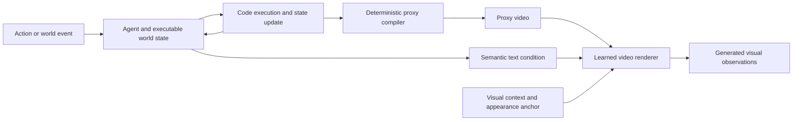

# From Video Reasoning to Executable Worlds

This perspective connects the [survey taxonomy](../README.md#taxonomy-and-modeling) to the [executable/hybrid catalog](../README.md#executable-world-models). It asks how observations, explicit state, dynamics, programs, and visual generation can work together. It does not assume that executable models will replace neural predictors or that every use of code constitutes a world model.

## What changes when a system maintains a world?

Video QA usually evaluates an answer derived from observations. Generative reasoning evaluates a sequence of candidate visual states. A persistent world system must additionally specify which state survives an interaction, how actions change it, and how the next observation relates to those changes. These requirements connect previously separate research lines without making them interchangeable.

Four distinctions are useful:

- **State versus dynamics.** A graph of objects, relations, or events can support an answer without specifying how an intervention changes the graph. A transition model adds that operation. Likewise, executable scene-construction code may reproduce a view without encoding temporal dynamics.
- **Inferred versus authoritative state.** In video analysis, hidden state is a hypothesis constrained by observations. In a constructed game, executable state may define the rules of that simulated world. Even then, the generated video may contradict it. A system needs a policy for detecting and resolving disagreement.
- **Simulation versus visual realization.** A video model can predict dynamics, instantiate a proposed solution, or render constraints supplied by another component. Which role it actually plays determines what a successful experiment demonstrates.
- **Program execution versus rule validity.** Running code verifies what that program does. It does not establish that the program captures the target environment, handles unseen actions, or preserves the intended semantics after edits.

The taxonomy therefore separates **representations/mechanisms** from **orchestration/interaction**. Programs join text, visual trajectories, graphs, and neural latents as one possible computational medium. Interleaving and streaming describe how these media are used together and under what observation constraints.

## A reading path through the literature

| Work | Intermediate object and operation | Connection to video-world reasoning | Evidence boundary |
| :--- | :--- | :--- | :--- |
| [WorldCoder (2024)](https://arxiv.org/abs/2402.12275) | Python world model revised through environment interaction and used by a planner | Makes transition knowledge explicit, executable, and transferable through edits | Gridworld/task-planning foundation; does not establish rich video perception |
| [GIF-MCTS (2024)](https://arxiv.org/abs/2405.15383) | Generate, improve, and fix code models using search and feedback | Separates model synthesis from cheap repeated program execution during planning | Textual environment descriptions and curated traces provide supervision not automatically available from video |
| [Spatial Code (2026)](https://arxiv.org/abs/2603.05591) | Temporally coherent object variables from video, followed by reasoning | Supplies a potential interface from visual observations to explicit state | Spatial code is a representation for QA, not evidence of a complete transition program |
| [VisualPatchWorld (2026)](https://arxiv.org/abs/2607.25236) | Select a dynamics form with active probes, fit parameters, then plan with the program | Image-derived scene graphs can provide state at replanning time | Model structure, parameter identification, perception, and contact-rich planning remain distinct sources of error |
| [Code World Model (2026)](https://arxiv.org/abs/2608.25927) | Agent-maintained code/state → deterministic proxy → learned video realization | Directly connects executable world evolution to video generation | Qualitative proxy-conditioned generation; no demonstrated complete autonomous world construction or autoregressive real-time generation |
| [StateAgent (2026)](https://arxiv.org/abs/2609.03673) | Entity-state representation updated under a new prompt, grounded as a future end frame | Exposes state consistency across generated video segments | An explicit state interface is not the same as a general executable rule engine |
| [Recursive Code World Models (2026)](https://arxiv.org/abs/2609.11499) | Recursive scene programs and reference/render comparison | Connects visual evidence to compositional executable scene construction | Starts from a single image; reconstruction results do not establish temporal prediction or interactive dynamics |

This is a conceptual reading path, not a claim that each paper builds on the preceding one. Similar names also need care: *WorldCoder* is a modeling/planning method; *WorldCoder-Bench* evaluates generated 3D programs. “Code world model” can also describe a model that predicts software execution traces; that is a different interface from code controlling a learned visual world.

## Case study: Code World Model

The following account is based on the [v1 full text](https://arxiv.org/html/2608.25927v1), particularly Sections 3–5, and the [author repository](https://github.com/buaacyw/code-world-model). It distinguishes the proposed architecture from the prototype's demonstrated capabilities.

### Where computation lives

The paper separates executable state from visual state. A coding agent handles semantically complex decisions and can invoke, compose, or revise world mechanisms. Existing code handles frequent updates such as positions, collisions, cooldowns, and rule execution. The video model supplies visual detail and motion conditioned on state-derived constraints.

The diagram summarizes component roles. It does not assert that all components run online or that the prototype has demonstrated autonomous repair from visual feedback. The coding agent's reasoning frequency, the executor's update frequency, and the visual generator's output rate are separate clocks.

The proxy is deliberately coarse: entity geometry, camera motion, positions, poses, and relations constrain the generated frames, while text specifies semantic intent and appearance. It is compiled deterministically from maintained state, rather than supplied as an unconstrained proposal by another generator. Consequently, the proxy interface exposes a measurable tradeoff: more detailed constraints improve control but require more state construction and can restrict the generator's freedom.

### What the experiments show

Section 4 reports adapting MiniMax-H3 Ref2VA using LoRA on 157 gameplay takes, about 5.6 hours of source video, sampled into 9,420 overlapping five-second clips. This clip count is not the number of independent source sequences. Training uses paired proxy sequences, text, and RGB targets; the audio objective is disabled.

At inference, the coding agent is given existing engine code, basic controls, collision handling, a runtime update loop, and proxy primitives. The paper describes using game scenes and logic as templates. Proxy videos are recorded from the constructed worlds and supplied to the generator. Qualitative examples also use an image-generated first-frame appearance anchor. Longer outputs are stitched from overlapping generation windows; this is distinct from autoregressive real-time interaction.

The qualitative results support controllable visual realization of proxy-specified scene layout, camera motion, and entity motion in the demonstrated worlds. The comparisons explicitly exclude inference latency. Section 5 states that the system does not implement autoregressive real-time generation and does not demonstrate autonomous construction of a complete open-world game or simulator. These boundaries matter when interpreting claims about a “world brain.”

The author repository provides inference documentation and links to a LoRA adapter and compact inference examples. A release makes an experiment more accessible, but this survey has not executed the model, reproduced the qualitative comparisons, or verified generalization beyond the reported setting. The adapter is not a standalone base model, and the released inference examples are not equivalent to the complete training data.

### What this adds to the survey

Placing the paper only under CoF would hide where important state transitions are decided: in code and the agent, not solely in the video generator. Placing it only under tool use would hide the persistence and revisability of the world program. Placing it with scene-graph QA would hide that the representation actively executes transitions and controls rendered observations.

The **executable/hybrid** branch captures this distinction while preserving connections to all three. It also brings a new evaluation obligation: check the correctness of the executable dynamics and the faithfulness of visual realization independently. A beautiful video may depict an impossible transition; a correct transition program may be rendered incorrectly; and a visually faithful renderer may reveal that the underlying program encodes the wrong rule.

## Interfaces worth studying next

These are proposed research directions, not capabilities established by the case study.

**From observation to hypotheses.** Use temporally grounded perception to infer state and candidate rules, with explicit uncertainty. For example, a door that appears shut may be locked, blocked, or temporarily unavailable. The same visible sequence can admit several explanations. Compare models with identical prior information and action access, and test interventions that distinguish the hypotheses. Do not give only the program-based method privileged engine state.

**From prediction to active identification.** A planner can choose an informative probe rather than only pursue an immediate task reward. VisualPatchWorld provides a concrete connection through active dynamics probes. For video systems, measure whether acquiring another view or interaction resolves uncertainty more effectively than generating additional plausible explanations. Keep the cost and causal availability of observations explicit.

**From generated worlds to checked worlds.** Define invariants such as object identity, resource conservation, valid collision outcomes, and action preconditions. Test both the executable transition and the corresponding rendered event. Some physical interactions remain underspecified by a coarse proxy; a model should not be credited with satisfying constraints that the interface never encoded.

**From memory to versioned mechanisms.** A memory update changes what the system believes about a state. A program edit changes how future states are computed. Evaluate these separately by introducing observation errors and real rule changes in different trials. Measure regression after edits, replay consistency, recovery time, and persistence of off-screen consequences. This is a possible connection between streaming memory and program revision, not a property already demonstrated by every streaming model.

**From predictive accuracy to usefulness for action.** A planner can exploit small errors in a learned or synthesized model. Evaluate rollouts on states/actions actually visited by the planner, rare but decisive transitions, and action success in the reference environment. High average prediction accuracy or passing a finite set of unit tests is insufficient evidence of planning adequacy.

## An evaluation design, not a new benchmark claim

[WorldCoder-Bench](https://arxiv.org/abs/2606.01869) evaluates generated 3D programs using runtime-state and behavioral checks. It is a useful bridge because screenshots alone can conceal incorrect mechanics; it is not a video-QA dataset. Existing video and generative benchmarks provide complementary evidence rather than a universal world-model score.

| Evaluation layer | Controlled comparison | Report separately |
| :--- | :--- | :--- |
| Perception and state estimation | Identical video prefixes, camera coverage, and action access; oracle state as a labeled ablation | Object/state accuracy, uncertainty calibration, missing/occluded-state errors |
| Transition model | Identical initial state and held-out actions; perturb parameters and rule families | Multi-step state error, violated invariants, rare-event failures, stochastic calibration |
| State-to-video realization | Identical executed state with different appearances; identical appearance with changed state | State compliance, identity persistence, camera/trajectory control, visual quality |
| Planning and reasoning | Same search budget, planner, tools, and feedback; compare learned/code/oracle transitions | Grounded answer quality, real task success, simulated-versus-real outcome gap |
| Continual interaction | Long delays, off-screen events, interruption, and rule changes | Persistence, revision regressions, time to recovery, action-to-visible-result latency |
| Reproducibility and cost | Freeze generator version, program revision, seeds, inputs, and resource budgets | Agent tokens, execution time, rendering compute, memory, and latency distributions |

A useful diagnostic example is an off-screen door interaction. Record the same initial state, apply either “unlock” or “leave untouched,” move the camera away, then return after intervening events. Check the stored lock state, the allowed action on return, and the rendered response. Vary appearance without changing mechanics, and vary mechanics without changing appearance. This separates memory, transition logic, rendering, and task success more clearly than judging one final clip.

## Evidence and maintenance

Reviewed on **2026-09-17**. Code World Model received full-text method/experiment/limitation review and author-repository inspection. New supporting papers were checked through primary metadata and abstracts; their full experimental claims have not been independently audited here. All mechanism comparisons and proposed experiments are survey synthesis, not claims of reproduced performance.

Future additions should state: the source of state, the transition representation, whether programs are executed or merely predicted, the role of the video model, the feedback used for revision, the actual online constraints, and the strongest evaluation the paper demonstrates. Keep unresolved questions visible instead of treating demonstrations as proof of general open-world intelligence.
